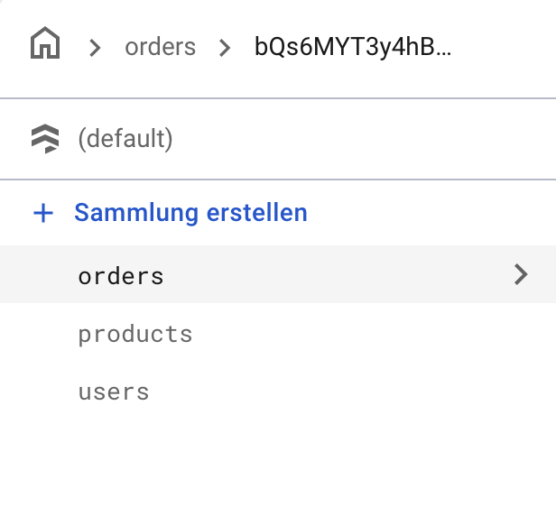
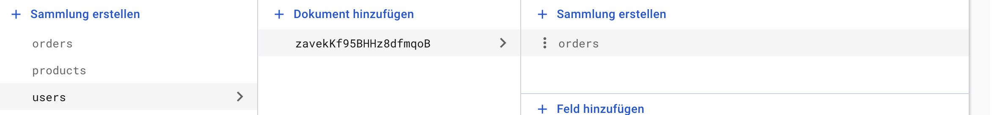

# 🔥 Firestore Security Rules & Serialization – Zusatzsession


> Dieses Dokument fasst die Zusatzsession zu **Firestore Security Rules** und **Serialization in Dart** zusammen.  
> Es erklärt, wie man Dart-Objekte für Firestore serialisiert/deserialisiert und wie man sichere Zugriffsregeln definiert.

---

## 📚 Inhaltsverzeichnis

1. [Serialization in Dart](#1-serialization-in-dart)
   - [.toMap() und .fromMap()](#11-tomap-und-frommap)
   - [Beispielcode](#12-beispielcode)
2. [Serialization testen](#2-serialization-testen)
3. [Vorüberlegungen zu Security Rules](#3-firestore-security-rules--vorüberlegungen)
4. [Security Rules Implementierung](#4-firestore-security-rules--implementierung)
5. [Zusammenfassung](#5-zusammenfassung)

---

## 1. Serialization in Dart

Damit Daten in **Firestore** gespeichert und wieder gelesen werden können, müssen wir sie zwischen Dart-Objekten und dem  
`Map<String, dynamic>`-Format umwandeln.

### 1.1 `.toMap()` und `.fromMap()`

- **`.toMap()`**  
  Wandelt ein Dart-Objekt in eine `Map<String, dynamic>` um, die Firestore speichern kann.  
  Verschachtelte Objekte (z. B. `AppUser`, `Product`) werden rekursiv serialisiert.

- **`.fromMap()`**  
  Erzeugt ein Dart-Objekt aus einer Map.  
  Wichtig: Korrektes Casting, besonders bei verschachtelten Listen und Objekten.  
  Firestore gibt Zahlen oft als `num` zurück, daher ist eine Typumwandlung nötig.

### 1.2 Beispielcode

```dart
// Helper-Funktionen für Firestore-Zahlen
double _numberToDouble(dynamic value) {
  if (value is int) return value.toDouble();
  if (value is double) return value;
  return 0.0;
}

int _numberToInt(dynamic value) {
  if (value is int) return value;
  if (value is double) return value.toInt();
  return 0;
}

class Order {
  AppUser customer;
  List<Product> products;

  Order(this.customer, this.products);

  Map<String, dynamic> toMap() {
    return {
      'customer': customer.toMap(),
      'products': products.map((product) => product.toMap()).toList(),
    };
  }

  factory Order.fromMap(Map<String, dynamic> map) {
    return Order(
      AppUser.fromMap(map['customer'] as Map<String, dynamic>),
      (map['products'] as List)
          .map((product) => Product.fromMap(product as Map<String, dynamic>))
          .toList(),
    );
  }
}

class Product {
  String name;
  String description;
  double price;
  String url;

  Product(this.name, this.description, this.price, this.url);

  Map<String, dynamic> toMap() {
    return {
      'name': name,
      'description': description,
      'price': price,
      'url': url,
    };
  }

  factory Product.fromMap(Map<String, dynamic> map) {
    return Product(
      map['name'] as String,
      map['description'] as String,
      _numberToDouble(map['price']),
      map['url'] as String? ?? '',
    );
  }
}


```

## 2. Serialization testen

So prüfst du, ob `.toMap()` und `.fromMap()` korrekt funktionieren:

1. Erstelle ein Objekt (`Product` oder `Order`).
2. Wandle es mit `.toMap()` in eine Map um.
3. Wandle die Map mit `.fromMap()` zurück in ein Objekt.
4. Vergleiche die Eigenschaften beider Objekte.

**Beispieltest:**

```dart
void main() {
  final product = Product(
    'Gemini Tasse',
    'Eine Tasse von Google Gemini.',
    15.99,
    'https://example.com/gemini-cup.png',
  );

  final productMap = product.toMap();
  print('Serialisierte Map: $productMap');

  final productFromMap = Product.fromMap(productMap);
  print('Deserialisiertes Produkt: ${productFromMap.name}, ${productFromMap.price}');
  print('Sind die Objekte identisch? '
        '${product.name == productFromMap.name && product.price == productFromMap.price}');
}
```

## 3. Firestore Security Rules – Vorüberlegungen

**Ziel:** Minimal nötige Berechtigungen vergeben, um Daten vor unbefugtem Zugriff zu schützen.

- **Zentrale Funktionen:**
  - `isAdmin()` – prüft, ob der Benutzer Admin ist.
  - `isAuthenticated()` – prüft, ob der Benutzer angemeldet ist.
- **Produkte:**
  - Öffentlich lesbar für angemeldete Benutzer.
  - Nur Admins dürfen erstellen, aktualisieren oder löschen.
- **Top-Level-Orders:**
  - Nur Erstellung durch authentifizierte Benutzer erlaubt.
  - Keine Updates oder Löschungen erlaubt.
- **User-Orders-Subkollektion:**
  - Benutzer sehen nur ihre eigenen Bestellungen.
  - Keine Schreibrechte, um die Integrität der Historie zu wahren.
- **Benutzerdaten:**
  - Benutzer dürfen nur auf ihre eigenen Dokumente zugreifen (`request.auth.uid == userId`).

### Das ist unsere aktuelle Firestore Implementierung




## 4. Firestore Security Rules – Implementierung

```firestore
rules_version = '2';
service cloud.firestore {
  match /databases/{database}/documents {

    // Admin definieren (ersetze UID mit der deines Admins)
    function isAdmin() {
      return request.auth.uid == 'vxzK09ATPCW55JHjoLYDNkySjXV2';
    }

    // Authentifizierte Nutzer
    function isAuthenticated() {
      return request.auth != null;
    }

    //
    // Regeln für die 'products'-Kollektion
    //
    match /products/{productId} {
      // Nur Admins können Produkte erstellen, aktualisieren oder löschen.
      allow write: if isAdmin();
      // Jeder authentifizierte Benutzer kann die Produkte lesen.
      allow read: if isAuthenticated();
    }

    // Regel für Top-Level-Order-Kollektion
    match /order/{orderId} {
      // Authentifizierte Benutzer können eine Bestellung erstellen.
      allow create: if isAuthenticated();
      // Update und Delete sind nicht erlaubt.
      allow read, update, delete: if false;
    }

    // Regeln für User
    match /users/{userId} {
      // Benutzer können nur auf ihre eigenen Daten zugreifen.
      allow read, write: if isAuthenticated() && request.auth.uid == userId;

      // Unterkollektion 'orders' für jeden Benutzer
      match /orders/{orderId} {
        // Authentifizierte Benutzer können nur ihre eigenen Bestellungen sehen.
        allow read: if isAuthenticated() && request.auth.uid == userId;
        // Erstellen, Aktualisieren oder Löschen nicht erlaubt.
        allow write, update, delete: if false;
      }
    }

  }
}
```
